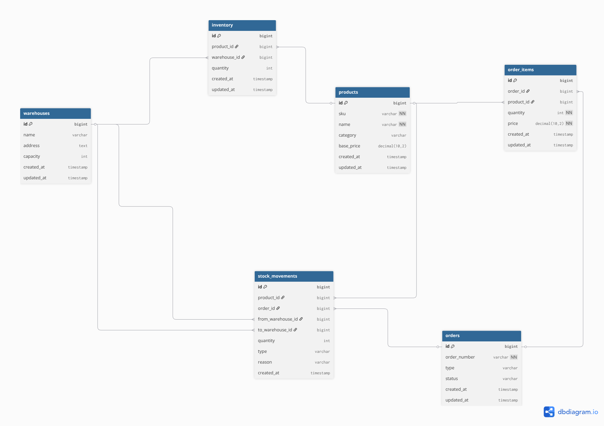

# 📦 Warehouse Management System (WMS) - Backend API

> **Hệ thống quản lý kho hàng thông minh được xây dựng trên nền tảng Java Spring Boot, tập trung vào tính chính xác của dữ liệu tồn kho, bảo mật đa tầng và khả năng mở rộng.**

---

## 🧐 1. Giới thiệu dự án

Dự án **WMS** được thiết kế để giải quyết các bài toán cốt lõi trong vận hành kho hàng thực tế. Thay vì chỉ là các thao tác CRUD đơn giản, hệ thống tập trung vào việc xử lý **Business Logic** phức tạp, đảm bảo tính nhất quán của dữ liệu khi có nhiều giao dịch xảy ra đồng thời.

### Mục tiêu kỹ thuật đạt được:

- **Clean Architecture:** Phân tách rõ ràng giữa các tầng Controller, Service và Repository.
- **Data Integrity:** Xử lý nghiêm ngặt các ràng buộc dữ liệu và Transaction.
- **Scalability:** Sẵn sàng cho việc đóng gói Container hóa với Docker.

---

## 🏗 2. Thiết kế Cơ sở dữ liệu (Database Design)

Dưới đây là sơ đồ thực thể (ERD) được thiết kế để tối ưu hóa việc quản lý quan hệ giữa sản phẩm, kho hàng và đơn hàng.

### Các thực thể chính:

- **Products:** Quản lý thông tin định danh (SKU, Barcode, Name, Unit Price).
- **Categories:** Phân loại sản phẩm theo danh mục.
- **Inventory:** Theo dõi số lượng tồn kho thực tế, cảnh báo khi hàng sắp hết.
- **Orders & OrderItems:** Lưu vết lịch sử xuất kho và chi tiết từng giao dịch.
- **Users & Roles:** Hệ thống phân quyền RBAC (Admin, Staff).

---

## 🛠 3. Công nghệ sử dụng (Tech Stack)

- **Language:** Java 21 (LTS)
- **Framework:** Spring Boot 3.x
- **Persistence:** Spring Data JPA (Hibernate)
- **Database:** MySQL
- **Security:** Spring Security & JWT (Json Web Token)
- **Validation:** Hibernate Validator (Bean Validation)
- **Mapping:** MapStruct / ModelMapper
- **Documentation:** Swagger UI (OpenAPI 3.0)
- **Tools:** Maven, Docker, Lombok, JUnit 5, Mockito

---

## 🚀 4. Tính năng nổi bật

- ✅ **Quản lý mã định danh:** Hỗ trợ quét và quản lý sản phẩm thông qua mã SKU và Barcode duy nhất.
- ✅ **Quản lý tồn kho thời gian thực:** Tự động khấu trừ số lượng khi đơn hàng được xác nhận.
- ✅ **Bảo mật stateless:** Sử dụng JWT để xác thực người dùng, giúp hệ thống nhẹ và dễ mở rộng.
- ✅ **API chuẩn RESTful:** Hệ thống API được thiết kế chuẩn xác, dễ dàng tích hợp với các ứng dụng Frontend hoặc Mobile.

---

## ⚙️ 5. Hướng dẫn cài đặt

1. **Clone repository:**
   git clone https://github.com/datngoca/WMS.git

2. **Cấu hình môi trường:**
   Sao chép file application.properties.example thành application.properties và cập nhật thông tin Database của bạn.

3. **Build và Chạy:**
   mvn clean install spring-boot:run

4. **Kiểm tra API:**
   Mở trình duyệt và truy cập: http://localhost:8080/swagger-ui.html
